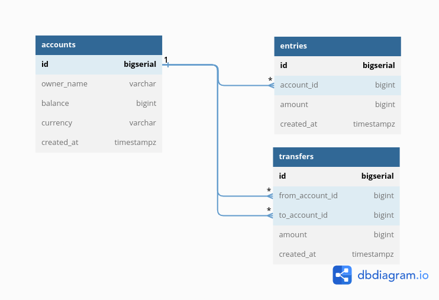

# Doing backend with golang!

In this repo, I am following this [series](https://www.youtube.com/watch?v=rx6CPDK_5mU&list=PLy_6D98if3ULEtXtNSY_2qN21VCKgoQAE)

The aim of this repo is to refresh my knowledge in golang by building backend that scale along side with reading : `Desinging data intensive applications`

## Idea/Features
A simple bank system that:
- Creates and manages accounts
- Records all balance changes
- Manages money transfer between acccounts

## Roadmap

- [ ] Design DB schema and generate SQL code with dbdiagram.io

> In this DB desing, we're creating a database for a very simple bank system in Postgres.
> Using [dbdiagram.io] to create a SQL design and export to (PNG, PDF, Postgres Format,...)

- [ ] Install & use Docker + Postgres + TablePlus to create DB schema
- [ ] How to write & run database migration in Golang
